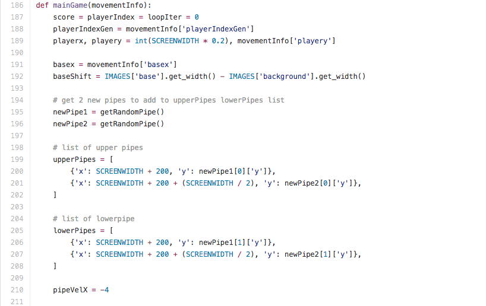
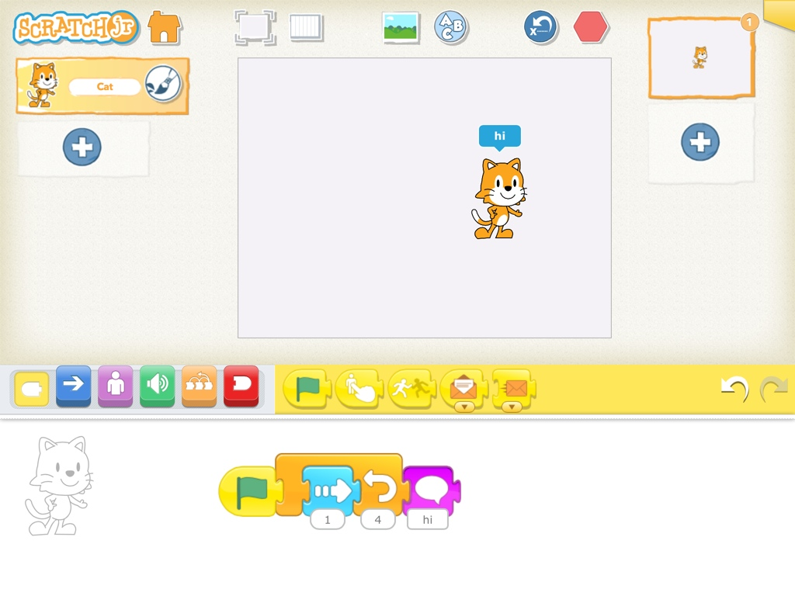
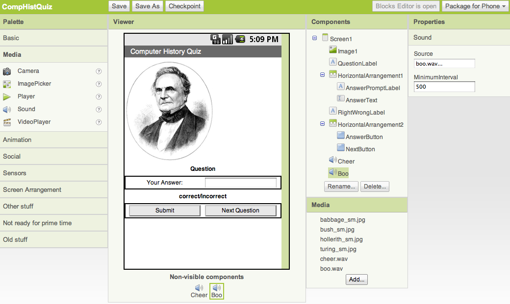
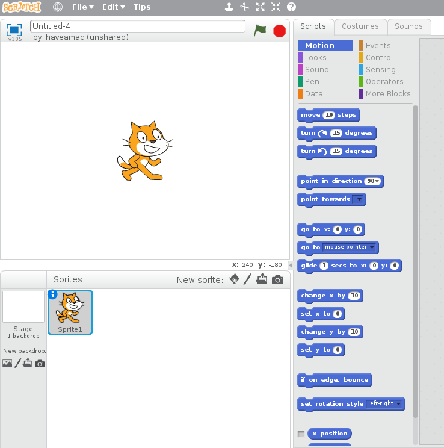
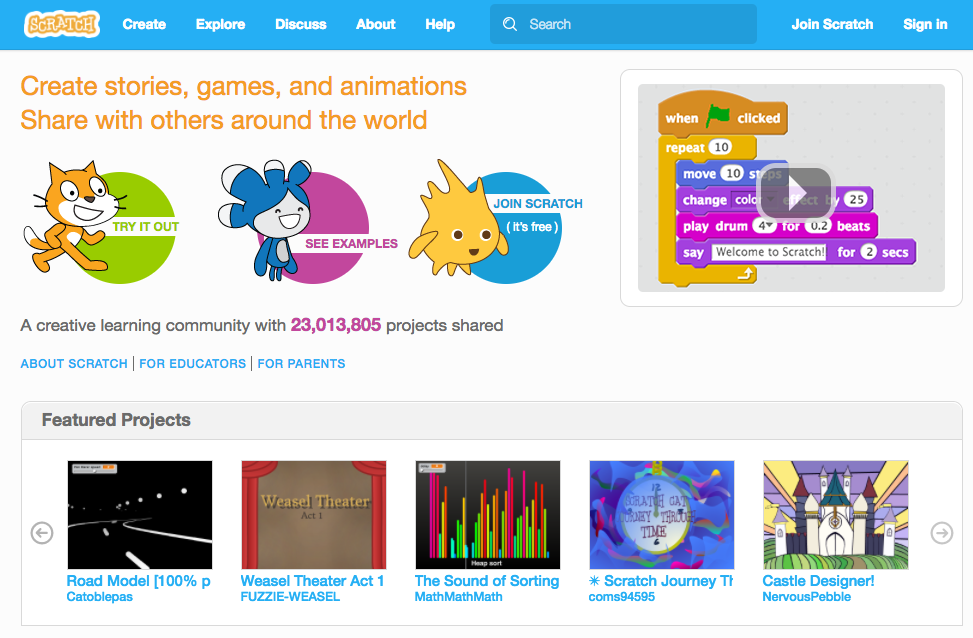

# Visual Programming with Scratch

## UON Computer Science 4 Schools

### Primary Workshop

#### Presented by Daniel Hickmott

---

# Session Plan

- Presentation: Overview of Visual Programming & Scratch (~15 minutes)
- Hands-On Activities (~1 hour)

---

# Presentation Contents

- Visual Programming & the DT curriculum
- What is Visual Programming?
- Examples of Visual Programming languages
- Scratch in K - 12
- Scratch Activity

---

# Visual Programming in ACARA DT

- Years 3 & 4: "_Implement simple digital solutions as **visual programs** with algorithms involving branching (decisions) and user input (ACTDIP011)_" 
- Years 5 & 6: "_Implement digital solutions as simple **visual programs** involving branching, iteration (repetition), and user input (ACTDIP020)_" 

---

# What is Visual Programming?

- Programming and Coding *usually* mean the same thing
- Coding is the act of writing instructions that a computer can understand and follow in some programming language
- Visual programs are those written in a *visual programming language*, e.g. *Scratch* or *AppInventor*
- Different to *general-purpose languages*, e.g. *JavaScript*, *Python*, *Java*

---

# General-Purpose Languages

--- 

# Visual Programming Languages

- Languages that allow you to code by using visual elements
- Great for Coding beginners
- Students can concentrate on *Computational Thinking*, instead of a language's *syntax* and *semantics*
- Some examples of different *visual programming languages* are shown on the next slides

---

# ScratchJr

- Commands are symbols rather than text
- Target age is 5 - 7 year olds
- Free app available for Android and iOS
- Suitable for early years or before introducing Scratch

---

# LEGO Mindstorms

- Interacts with LEGO Mindstorms robots
- Write code to move a robot or collect data from its sensors
- Used in previous session (*Writing Algorithms*)

---

# AppInventor

- Allows you to create apps that run on Android phones and tablets
- Can use features of phones, e.g. vibration or maps
- Not used in this workshop (but resources for this are available on the *Extras* page on the CS4PS website)

---

# Scratch 

- Commonly used to introduce K - 12 students to *Coding* and *Computational Thinking*
- Students can create games, animations and interactive stories
- Many high quality resources and lessons available online (see CS4PS website)

---

---

# Scratch

- Who has heard of Scratch?
- The Philosophy behind Scratch
	- Designed for *tinkerability*
	- Encourages collaboration and sharing
- Low floor, wide walls and high ceiling
- Who is already using it in their classrooms?

---

# Visual Programming Activity

- Go to the Scratch website: [www.scratch.mit.edu](www.scratch.mit.edu.au)
- We have two step-by-step tutorials for you:
  - An Introduction to Scratch
  - Making Cookie Bird
- Let us know if you have any questions about Scratch
