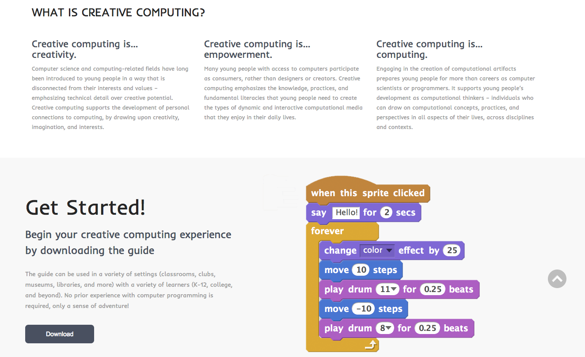
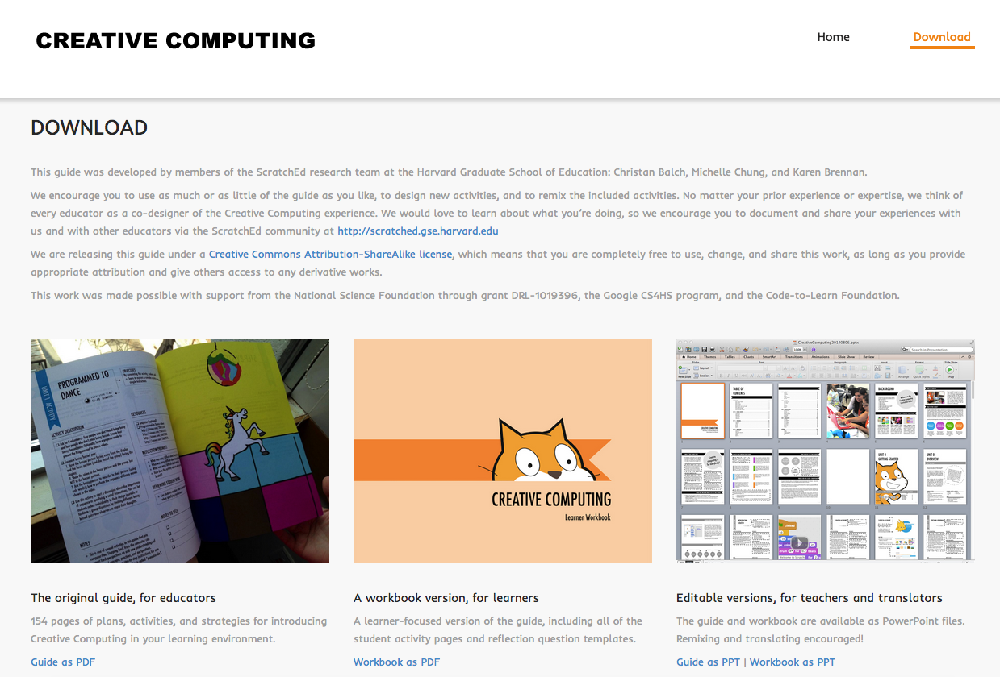
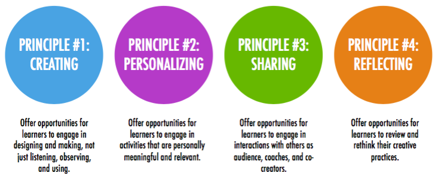
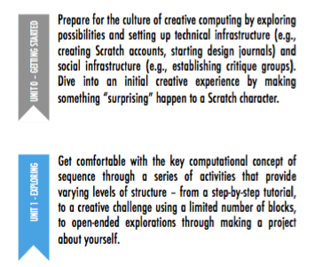

# Creative Computing with Scratch

## UON Computer Science 4 Schools

### Primary School Workshop

#### Presented by Daniel Hickmott

---

# What is Creative Computing?

- Yesterday's Scratch activity mostly involved step-by-step exercises
- You may want to allow students to be more self-directed when teaching them to code
- *Creative Computing* emphasises students' personal connections to computing
- Encourages students to use code to implement their own ideas and invent

---

# The Creative Computing Curriculum

- Developed by researchers and educators from the *Harvard Graduate School of Education*
- Is focused on using Scratch to teach computing
- Covers key *computational thinking concepts* and *computational thinking practices*
- Split into 7 themed units, e.g. *Stories* and *Games*
- The link to the material is on the CS4PS website, on the *Creative Computing with Scratch* session page

---

---

---

# Balancing Structure & Agency

- Research by Dr Karen Brennan (from Harvard) influenced the design of the curriculum materials
- Brennan[^1] investigated the balancing learners' *agency* and *structure* when teaching computing, both inside and outside of schools
- Argued that "we should begin to think about agency and structure not as separate, but as mutually-reinforcing concepts" (p. 194)
- Proposed strategies for teaching computing that became part of the *Creative Computing Curriculum*

[^1]: Brennan, K. Best of both worlds: Issues of structure and agency in computational creation, in and out of school. Dissertation. Massachusetts Institute of Technology, 2013.

--- 

# Four Principles of the Curriculum

 

---

# Today's Session: Units 0 and 1

---

# Unit 0: Getting Started 

- *Unit 0 (Getting Started)* is a preparatory unit focused on getting students to set up Scratch accounts and other administrative tasks
- Assumes you are using the online version of Scratch and that your school has access to Scratch

---

# Unit 0: Getting Started 

- Teacher Accounts
- Design Journals
- Sharing your creations (Scratch Surprise)
- Scratch Studios
- Critique Groups

---

# Teacher Accounts 

- *Creative Computing Curriculum* guide was written before Teacher Accounts were made available
- Highly recommend getting a Teacher Account for managing your classes
- Can see students' activity in Scratch
- Can reset students' passwords when they lose or forget it
- Usually take about 24 hours to be approved
- Does anyone have use a Teacher Account already?

---

# Teacher Accounts: Overview

- Please login with the account details I sent you through email
- Create a new Scratch program
- Let's look at the Activity tab
- Signing up Students
	- + New student
	- CSV Upload
	- Student Sign-up Link

---

# Design Journals

- Refer to *Design Journal* activity in *Creative Computing Curriculum* Guide (p. 14)
- [http://bit.ly/designjournal-blog](http://bit.ly/designjournal-blog) has example of a journal in blog form 

---

# Sharing your Creations

- Refer to *Scratch Surprise* activity in *Creative Computing Curriculum* Guide (p. 16)
- Take 10 minutes to explore some Scratch blocks and sections that you haven't explored yet
- Try and make the Cat do something surprising!
- Share your creations

---

# Scratch Studios

- Refer to *Scratch Studios* activity in *Creative Computing Curriculum* Guide (p. 18)
- I'll create a Scratch Studio for our *Scratch Surprises* and send the link to this through email
- Try and add your *Scratch Surprise* project to this new *Scratch Studio*

---

# Critique Groups

- Refer to *Critique Groups* activity in *Creative Computing Curriculum* Guide (p. 20)
- I don't know how successful these would be - does anyone do Scratch critique groups already or use similar approaches in other subjects?

--- 

# Unit 1: Exploring

- As mentioned earlier, the design of the *Creative Computing Curriculum* has been influenced by research about balancing learners' *structure* and *agency*
- *Unit 1 (Exploring)* is focused on activities that encourage students to explore the Scratch interface and different blocks
- One of the important points of this Unit's overview (p. 24) is that educators don't necessarily have to know every block and part of Scratch's interface

--- 

# Unit 1: Exploring

- Programmed to Dance
- Step-By-Step
- 10 Blocks
- My Studio
- Debug It!
- About Me

---

# Programmed to Dance

- Refer to *Programmed to Dance* activity in the *Creative Computing Curriculum* Guide (p. 26)
- This is another example of an *unplugged* activity
- Let's look at one of the videos and write instructions for someone to follow
- Could have students in groups create their own dances or choose one of the videos and swap with other groups

---

# Step-By-Step

- Refer to *Step-By-Step* activity in the *Creative Computing Curriculum* Guide (p. 28)
- Take 10 minutes to complete this activity 
- Try to incorporate some ideas from the *Things to Try* section of the activity
- Add to the *Step-By-Step* studio if you would like to share your program

--- 

# 10 Blocks

- Refer to *Step-By-Step* activity in the *Creative Computing Curriculum* Guide (p. 30)
- Take 10 minutes to complete this activity 
- You have to use each of the blocks shown on p. 30 at least once - you can also use them multiple times
- Add to the *10 Blocks* studio if you'd like to share your program

---

# My Studio (Remixing)

- In this activity, we will remix an existing Scratch program instead of the activity in the *Creative Computing Curriculum* Guide
- Take 10 minutes to find a program that you'd like to remix and make some change to it
- We'll also briefly look at remix trees and discuss potential issues with students remixing projects

---

# Debug It!

- Refer to *Step-By-Step* activity in the *Creative Computing Curriculum* Guide (p. 34)
- Debug It! exercises involve fixing Scratch programs that have *bugs* (mistakes) in them
- These activities could be used for assessment of student's understanding of Scratch and coding concepts
- Fixing bugs (*debugging*) is a large part of a coder's job

---

# About Me

- Refer to *About Me* activity in the *Creative Computing Curriculum* Guide (p. 36)

